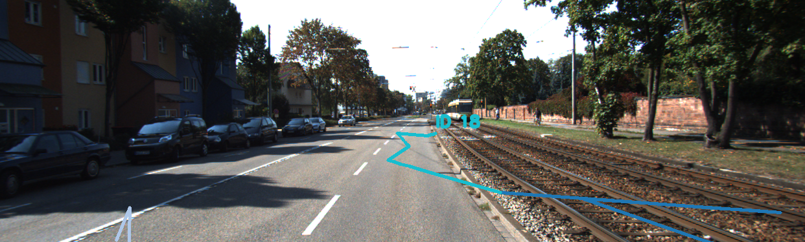
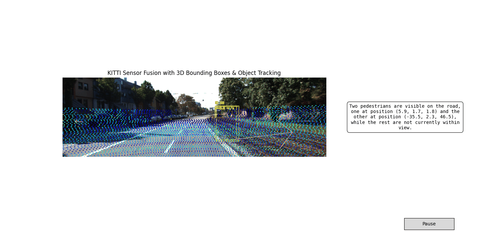

# Multisensor Fusion & Real-Time 3D Object Tracking Pipeline Using KITTI Dataset

[](LICENSE)  
  
  
  


---

## Project Overview

This **Multisensor Fusion & Real-Time 3D Object Tracking** pipeline leverages the KITTI dataset's camera images, LiDAR point clouds, and ground truth labels to create an interactive visualization of dynamic traffic scenes.

- **Robust sensor fusion** combining LiDAR depth and RGB camera images.
- **Persistent object tracking** using a DeepSORT algorithm: a Kalman Filter paired with a CNN appearance embedder and Hungarian algorithm data association.
- **Dynamic 3D bounding boxes** projected onto 2D images, color-coded per tracked ID.
- **Natural language scene summaries** generated live via OpenAI GPT-3.5 Turbo.
- **Directional trajectory arrows** that visualize object motion between frames.
- **Rich visual outputs** including a GIF animation and a trajectory summary image.

---

## Key Features

- **Multi-Modal Sensor Fusion:** Align and combine LiDAR point clouds with camera images using KITTI calibration matrices (LiDAR → camera → rectified → image plane).
- **3D Bounding Box Computation:** Rotation-aware 3D boxes computed from KITTI labels and projected into the image frame.
- **DeepSORT Multi-Object Tracking:** Full DeepSORT pipeline with Kalman Filter motion prediction, CNN appearance embeddings, Mahalanobis gating, cosine distance gallery matching, and Hungarian algorithm assignment.
- **Track State Management:** Tracks cycle through `tentative → confirmed → deleted` states, filtering spurious detections and surviving short occlusions.
- **Appearance Gallery:** Each track stores a rolling history of up to 100 appearance embeddings, making re-identification robust to single bad frames.
- **Trajectory Direction Arrows:** Visual indicators of object movement direction between consecutive frames.
- **OpenAI GPT-3.5 Turbo Integration:** Contextual, concise scene summaries generated each frame and a final scene evolution summary printed after the animation.
- **Intuitive Visualization:** Side-by-side matplotlib animation with pause/play controls.
- **Exportable Results:** GIF animation and trajectory summary image saved automatically on exit.

---

## Project Structure

```text
├── animate_fusion.py                     # Main animation, visualization, and fusion script
├── kalman_tracker.py                     # DeepSORT tracker: Kalman filter, Hungarian assignment, cascade matching
├── bbox_visualizer.py                    # Standalone utility to visualize 3D bounding boxes on a single frame
├── explore_kitti.py                      # Script to explore raw KITTI images and LiDAR data
├── deep_sort/
│   ├── __init__.py
│   ├── embedder.py                       # MobileNetV2 CNN appearance embedder
│   └── nn_matching.py                    # Cosine distance gallery and cost matrix
├── README.md                             # This file
├── label_2/                              # KITTI label files (ground truth annotations)
├── 2011_09_26_drive_0001_sync/           # KITTI raw data (images & LiDAR point clouds)
└── 2011_09_26/                           # KITTI calibration files
```

---

## Installation & Setup

1. **Clone the repository**

   ```bash
   git clone https://github.com/GKoutilya/your-repo-name.git
   cd your-repo-name
   ```

2. **Install dependencies**

   ```bash
   pip install numpy opencv-python matplotlib openai filterpy scipy torch torchvision pillow
   ```

3. **Download the KITTI Dataset**

   - Download from the [KITTI Vision Benchmark Suite](http://www.cvlibs.net/datasets/kitti/).
   - Place the raw data sequence in `2011_09_26_drive_0001_sync/`, calibration files in `2011_09_26/`, and label files in `label_2/`.

4. **Set your OpenAI API Key**

   On Windows PowerShell:

   ```powershell
   $env:my_api_key = "your_actual_api_key_here"
   ```

   On Unix/macOS:

   ```bash
   export my_api_key="your_actual_api_key_here"
   ```

   The GPT summaries will gracefully fail with an error message if no key is set — the rest of the pipeline still runs.

---

## How to Run

```bash
python animate_fusion.py
```

- Use the **Pause/Play** button to freeze the animation at any frame.
- On window close, `fusion_tracking.gif` and `trajectory_summary.png` are saved automatically.
- The final GPT scene evolution summary prints to the terminal.

---

## Technical Details

### Sensor Fusion Pipeline

KITTI provides three calibration matrices that chain together to project LiDAR points into the image plane:

- **`Tr_velo_to_cam`** — rigid body transform from LiDAR to camera coordinates
- **`R_rect`** — rectification matrix correcting stereo camera misalignment
- **`P2`** — camera projection matrix (intrinsics) mapping 3D to 2D pixels

LiDAR points are downsampled, filtered to the camera's field of view, projected, and rendered as a colored scatter plot over the camera image, colored by intensity.

### DeepSORT Tracking

The tracker runs every frame in six steps:

1. **Predict** — all active Kalman filters advance their state using a constant velocity motion model
2. **Embed** — each detection's 2D bounding box is cropped from the camera image and passed through the CNN appearance embedder to produce a 1280-d feature vector
3. **Cascade match** — confirmed tracks are matched to detections using a combined cost matrix of appearance (cosine distance from the gallery) and motion (Mahalanobis distance from the Kalman filter), gated and solved with the Hungarian algorithm
4. **Distance match** — unmatched detections are matched to tentative tracks using Euclidean distance
5. **Update** — matched tracks update their Kalman filter and append to their appearance gallery; unmatched tracks are marked as missed
6. **Lifecycle** — new tentative tracks are spawned for unmatched detections; tracks deleted after exceeding `MAX_AGE` missed frames

### Appearance Embedder (`deep_sort/embedder.py`)

A pretrained **MobileNetV2** backbone (ImageNet weights) with the classifier head removed. The convolutional features are globally average-pooled to a 1280-d vector and L2-normalized, making cosine distance comparisons valid.

### Appearance Gallery (`deep_sort/nn_matching.py`)

Each track stores its last 100 embeddings. The cost matrix entry for a detection-track pair is `1 - max_k(dot(detection, gallery[k]))` which is the best appearance match anywhere in the track's history.

### Track State Management

| State | Condition | Behaviour |
|-------|-----------|-----------|
| `tentative` | New track | Not drawn; deleted immediately on first miss |
| `confirmed` | ≥ `MIN_HITS` consecutive matches | Drawn in visualization; survives up to `MAX_AGE` missed frames |
| `deleted` | Exceeded `MAX_AGE` or missed as tentative | Pruned from tracker and gallery |

---

## Engineering Trade-offs

### Non-ReID Backbone

The appearance embedder uses **MobileNetV2 pretrained on ImageNet** rather than a dedicated ReID backbone (e.g. OSNet trained on Market-1501 or VeRi-776). This was a deliberate engineering decision driven by two constraints:

**1. Platform:** `torchreid` (the standard library for pretrained ReID models) is not available on PyPI and requires a manual build process that is unreliable on Windows. MobileNetV2 is available directly from `torchvision`, which is already a required dependency, eliminating any additional install complexity.

**2. Dataset mismatch:** The most commonly available pretrained ReID backbones are trained on *pedestrian* datasets (Market-1501, DukeMTMC). This project tracks *vehicles*. A pedestrian-trained ReID model is not meaningfully better than a general ImageNet backbone for vehicle re-identification because both are out-of-distribution. The correct solution would be a model trained on a vehicle ReID dataset such as VeRi-776 or VehicleID, which are not easily available as pretrained weights.

### Threshold Tuning

Because MobileNetV2's ImageNet features are not calibrated for ReID, cosine distances between the same vehicle across adjacent frames are higher than they would be with a proper ReID backbone. This required relaxing two thresholds in `kalman_tracker.py`:

| Parameter | Ideal value (proper ReID backbone) | Actual value (MobileNetV2) | Reason |
|-----------|-----------------------------------|---------------------------|--------|
| `MAX_COSINE_DISTANCE` | 0.4 | 0.7 | ImageNet features produce higher cosine distances for the same object across frames |
| `MIN_HITS` | 3 | 2 | 25-frame sequence; tighter confirmation would hide objects for too large a fraction of the clip |

These values are conservative trade-offs: 0.7 is permissive enough for the embeddings to carry meaningful signal while still preventing egregiously wrong matches. If the backbone were upgraded to a vehicle ReID model, both parameters should be tightened back to their ideal values.

### Ground Truth Labels

This pipeline uses KITTI's ground truth annotation files rather than a real-time object detector. This means detection quality is perfect by design with no false positives and no missed detections. In a production system, detections would come from a model like YOLOv8 or PointPillars, introducing noise that would make the Mahalanobis gating and appearance matching more critical. The architecture is designed to handle this; only the data source would change.

---

## Results

### Trajectory Summary Image



*All tracked object trajectories and IDs overlaid on the final frame.*

### Real-Time Animated GIF



*Full animation of sensor fusion, 3D bounding boxes, tracking, and GPT scene summaries.*

---

## Future Work

- **Vehicle ReID backbone:** Replace MobileNetV2 with a model trained on VeRi-776 or VehicleID. This would allow tightening `MAX_COSINE_DISTANCE` to ~0.4 and restoring `MIN_HITS` to 3, improving ID consistency in crowded scenes.
- **Real object detector integration:** Replace ground truth labels with YOLOv8 or PointPillars detections to test the pipeline under realistic noisy conditions.
- **Multi-class tracking:** Separate tracking pipelines or appearance galleries per object class (Car, Pedestrian, Cyclist).
- **Multi-camera setup:** Extend to full 360° perception using all KITTI camera streams.
- **Longer sequences:** Test on multi-minute KITTI sequences to evaluate track lifecycle management under prolonged occlusion.

---

## Contributions

Contributions, bug reports, and feature requests are welcome. Please open an issue or submit a pull request.

---

## License

This project is licensed under the **MIT License**. See the [LICENSE](LICENSE) file for details.

---

## About Me

I am passionate about robotics, autonomous vehicles, and AI-powered perception systems. This project reflects my work in sensor fusion, multi-object tracking, and LLM integration for explainability.

**Contact:**  
- [GitHub](https://github.com/GKoutilya)  
- [LinkedIn](https://www.linkedin.com/in/koutilya-ganapathiraju-0a3350182/)  
- gkoutilyaraju@gmail.com

---

## Thank you for checking out my project!

---
