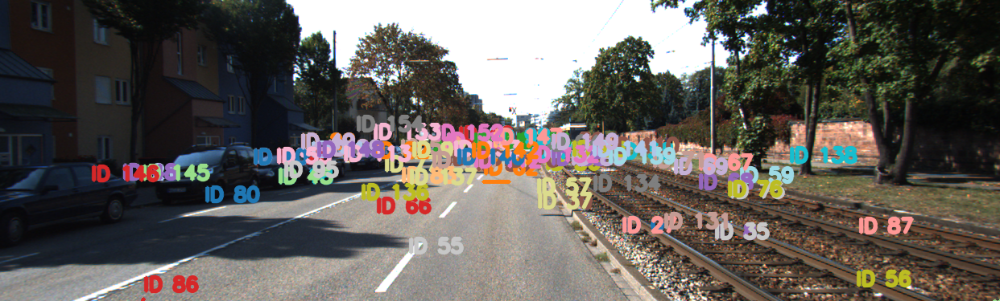

# Multisensor Fusion & Real-Time 3D Object Tracking Pipeline Using KITTI Dataset

[](LICENSE)  
  
  
  

---

## 🚀 Project Overview

This advanced **Multisensor Fusion & Real-Time 3D Object Tracking** pipeline leverages the KITTI dataset's camera images, LiDAR point clouds, and labels to create a seamless, interactive visualization of dynamic traffic scenes.

- **Robust sensor fusion** combining LiDAR depth and RGB camera images.
- **Persistent object tracking** using a custom Kalman Filter-based multi-object tracker.
- **Dynamic 3D bounding boxes** projected onto 2D images, color-coded per tracked ID.
- **Natural language scene summaries** generated live via OpenAI GPT-3.5 Turbo — describing traffic behavior frame-by-frame.
- **Rich visual outputs** including GIF animations of tracking and a detailed trajectory summary image.
- Designed for **real-time performance** with downsampling and efficient data handling.

This project is a showcase of state-of-the-art robotics perception, sensor fusion, and AI-powered explanation — a perfect portfolio piece for roles in autonomous vehicles, robotics, and intelligent systems.

---

## 🎯 Key Features

- **Multi-Modal Sensor Fusion:** Align and combine LiDAR point clouds with camera images using KITTI calibration data.
- **3D Bounding Box Computation:** Accurate spatial representation of detected objects with rotation-aware 3D boxes.
- **Kalman Filter Multi-Object Tracking:** Maintain consistent IDs over frames despite occlusion and noise.
- **OpenAI GPT-3.5 Turbo Integration:** Contextual, concise scene summaries enhance interpretability and explainability.
- **Intuitive Visualization:** Side-by-side matplotlib animation with pause/play controls and well-structured UI.
- **Exportable Results:** Save high-quality GIF animations and trajectory summary snapshots for analysis and presentations.

---

## 📁 Project Structure

```text
.
├── animate_fusion.py           # Main animation and visualization script
├── kalman_tracker.py           # Custom Kalman filter multi-object tracking module
├── README.md                   # This documentation file
├── requirements.txt            # Python dependencies
├── label_2/                   # KITTI label files for object annotations
├── 2011_09_26_drive_0001_sync/ # KITTI dataset folder (images & LiDAR)
└── calib/                     # KITTI calibration files
````

---

## 🛠️ Installation & Setup

1. **Clone the repository**

   ```bash
   git clone https://github.com/yourusername/your-repo-name.git
   cd your-repo-name
   ```

2. **Install Python 3.13 and dependencies**

   Recommended to use a virtual environment:

   ```bash
   python -m venv venv
   source venv/bin/activate  # On Windows: venv\Scripts\activate
   pip install -r requirements.txt
   ```

3. **Download the KITTI Dataset**

   * Download the required sequences from the official [KITTI Vision Benchmark Suite](http://www.cvlibs.net/datasets/kitti/).
   * Organize the dataset in the folder structure as described above.
   * Place calibration files in the `calib/` folder and labels in `label_2/`.

4. **Set your OpenAI API Key as environment variable**

   * On Windows PowerShell:

     ```powershell
     [Environment]::SetEnvironmentVariable("my_api_key", "your_actual_api_key_here", "User")
     ```

   * On Unix/macOS terminal:

     ```bash
     export my_api_key="your_actual_api_key_here"
     ```

---

## 🚀 How to Run

Simply execute the main animation script:

```bash
python animate_fusion.py
```

* Use the **Pause/Play** button to control the animation.
* After closing the window, a GIF animation (`fusion_tracking.gif`) and a trajectory summary image (`trajectory_summary.png`) will be saved automatically.
* Watch live 3D bounding boxes, tracked IDs, and dynamic GPT-generated scene summaries!

---

## 🧠 Technical Details

* **Sensor Fusion Pipeline:**
  Using KITTI's Velodyne-to-camera calibration matrices, the 3D LiDAR points are projected onto the 2D camera plane. Points are colored by intensity for intuitive depth perception.

* **Tracking:**
  A custom `MultiObjectTracker` class (Kalman filter based) maintains object identities and trajectories, handling frame-to-frame association robustly.

* **3D Bounding Boxes:**
  Object dimensions, locations, and yaw rotations from KITTI labels are used to compute accurate 3D box corners, projected into the image frame.

* **Scene Summarization:**
  The OpenAI GPT-3.5 Turbo model receives current tracked objects and outputs a concise human-readable summary of traffic flow and object states, updated every frame.

* **Visualization:**
  Built with matplotlib’s `FuncAnimation` and interactive widgets for user-friendly control.

---

## 📈 Results

### Trajectory Summary Image



*Displays all tracked object trajectories and IDs over the last frame.*

### Real-Time Animated GIF


*Captures the live tracking and sensor fusion animation.*

---

## 🔮 Future Work

* Incorporate **multi-class object detection** to refine tracking accuracy.
* Add **real-time alerting** on anomaly detection or object behavior changes.
* Extend to **multi-camera setups** for full 360° environment perception.
* Integrate **deep learning-based perception models** for enhanced robustness.

---

## 🤝 Contributions

Contributions, bug reports, and feature requests are welcome! Please open an issue or submit a pull request.

---

## 📜 License

This project is licensed under the **MIT License** — see the [LICENSE](LICENSE) file for details.

---

## 🙋‍♂️ About Me

I am passionate about robotics, autonomous vehicles, and AI-powered perception systems. This project reflects my deep expertise in sensor fusion, tracking algorithms, and LLM integration for explainability.

**Contact Me:**  
- GitHub: [GitHub](https://github.com/GKoutilya)  
- LinkedIn: [LinkedIn](www.linkedin.com/in/koutilya-ganapathiraju-0a3350182)  
- Email: gkoutilyaraju@gmail.com

Feel free to reach out if you want to discuss collaborations or technical questions!

---

# Thank you for checking out my project! 🚗🤖✨